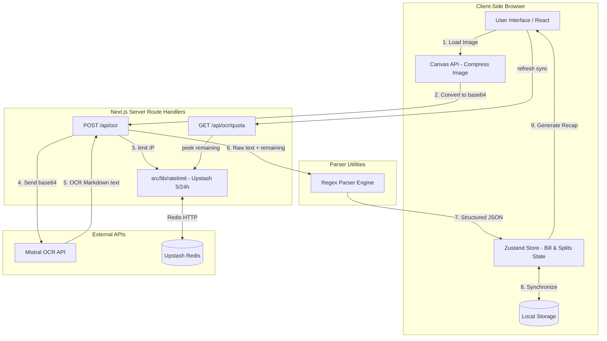

# Architecture

## Stack

- **Framework**: Next.js 16 (App Router)
- **Language**: TypeScript
- **Styling**: Tailwind CSS v4
- **State Management**: Zustand (Client-side draft state with localStorage persist middleware)
- **OCR Engine**: Mistral OCR API (`mistral-ocr-latest`) — server-side via `/api/ocr` Route Handler
- **Rate Limiting**: Upstash Redis (`@upstash/ratelimit`) — 5 uploads per IP per 24 hours, enforced in `POST /api/ocr` (same runtime as quota peek)
- **Deployment**: Vercel

---

## Folder Structure

```
├── .agents/               # Agent-specific skills and configs
├── context/               # Core project context (architecture, tokens, plan)
├── public/                # Static assets (tesseract language training data if offline)
├── src/
│   ├── app/               # Next.js App Router pages
│   │   ├── globals.css    # Tailwind v4 entry and global theme variables
│   │   ├── layout.tsx     # Root layout with font and metadata configuration
│   │   └── page.tsx       # Main OCR upload and Split Bill dashboard
│   ├── components/        # Reusable presentation and interactive UI components
│   │   ├── ui/            # Shadcn/primitive UI components
│   │   └── custom/        # Application-specific components (OCR scanner, bill cards)
│   ├── hooks/             # Custom React hooks (e.g., useReceiptStore)
│   ├── lib/               # Utility functions and parser helpers
│   │   ├── parser.ts      # Regex parsing engine
│   │   ├── ratelimit.ts   # Shared Upstash rate limiter (limit + getRemaining)
│   │   └── mistralOCR.ts  # Mistral OCR SDK wrapper
│   └── types/             # Shared TypeScript interfaces
```

---

## System Boundaries



---

## Invariants

Rules the AI agent must never violate:

- **API Key Security**: `MISTRAL_API_KEY`, `UPSTASH_REDIS_REST_URL`, and `UPSTASH_REDIS_REST_TOKEN` must never be committed to the repository or exposed to the client bundle. Always read from `process.env` on the server.
- **OCR is Server-Side**: Never call Mistral SDK or any external OCR API from a Client Component. OCR must go through `/api/ocr` (Route Handler).
- **Rate Limit in OCR Route**: The shared `Ratelimit` instance lives in `src/lib/ratelimit.ts`. `POST /api/ocr` calls `limit(ip)` before Mistral; `GET /api/ocr/quota` peeks via `getRemaining(ip)`. Both use the same Node runtime + `clientIp()` so Redis keys stay consistent. Do not consume tokens in Edge middleware (IP headers can diverge from the Route Handler). Reject oversized `imageBase64` (~2 MB binary soft safety cap after client `compressForOcr`) before `limit()` so bad payloads do not burn a scan. Uploader accepts originals up to 10 MB.
- **Quota peek**: `GET /api/ocr/quota` restores the scan counter after refresh without spending a scan. Client uses a `quotaEpoch` so stale peeks cannot overwrite OCR-driven remaining; re-peeks when a scan session ends and when the local reset countdown expires. `API_ERROR` responses include `remaining`/`reset` and the client applies them.
- **100% Client-Side Calculations**: All bill computations, subtotal, and tax allocations must run entirely in browser state.
- **LocalStorage 2-Hour TTL**: Persisted draft state must expire and clear automatically if the saved timestamp is older than 2 hours.
- **Upload Reset Rule**: Uploading a new image must immediately clear all existing data in `localStorage` before parsing the new receipt.
- **UI Constraint**: Do not build a "Clear" or "Reset" button in the UI; the state is managed automatically via the expiration timer and new image uploads.
- **No raw color classes**: Do not use hardcoded hex values or raw Tailwind color classes (e.g. `bg-[#1e293b]`). Use custom-defined design tokens (mapped via Tailwind `@theme` to CSS variables defined in `globals.css` / `ui-tokens.md`).
