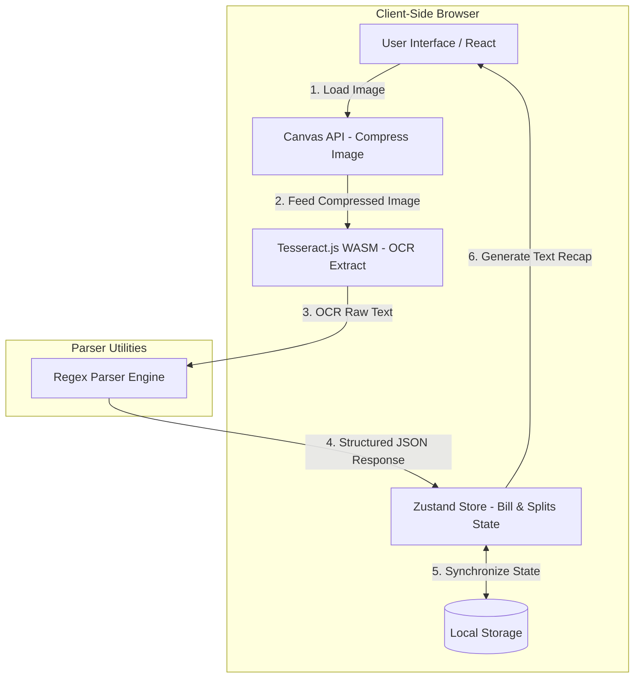

# Architecture

## Stack

- **Framework**: Next.js 16 (App Router)
- **Language**: TypeScript
- **Styling**: Tailwind CSS v4
- **State Management**: Zustand (Client-side draft state with localStorage persist middleware)
- **OCR Engine**: Tesseract.js (Client-side WebAssembly)
- **Deployment**: Vercel

---

## Folder Structure

```
├── .agents/               # Agent-specific skills and configs
├── context/               # Core project context (architecture, tokens, plan)
├── public/                # Static assets (tesseract language training data if offline)
├── src/
│   ├── app/               # Next.js App Router pages
│   │   ├── globals.css    # Tailwind v4 entry and global theme variables
│   │   ├── layout.tsx     # Root layout with font and metadata configuration
│   │   └── page.tsx       # Main OCR upload and Split Bill dashboard
│   ├── components/        # Reusable presentation and interactive UI components
│   │   ├── ui/            # Shadcn/primitive UI components
│   │   └── custom/        # Application-specific components (OCR scanner, bill cards)
│   ├── hooks/             # Custom React hooks (e.g., useReceiptStore)
│   ├── lib/               # Utility functions and parser helpers
│   │   └── parser.ts      # Regex parsing engine
│   └── types/             # Shared TypeScript interfaces
```

---

## System Boundaries



---

## Invariants

Rules the AI agent must never violate:

- **100% Client-Side Calculations**: All bill computations, subtotal, and tax allocations must run entirely in browser state.
- **Data Privacy**: No receipt images or parsed transaction records may be sent to external APIs or servers.
- **LocalStorage 2-Hour TTL**: Persisted draft state must expire and clear automatically if the saved timestamp is older than 2 hours.
- **Upload Reset Rule**: Uploading a new image must immediately clear all existing data in `localStorage` before parsing the new receipt.
- **UI Constraint**: Do not build a "Clear" or "Reset" button in the UI; the state is managed automatically via the expiration timer and new image uploads.
- **No raw color classes**: Do not use hardcoded hex values or raw Tailwind color classes (e.g. `bg-[#1e293b]`). Use custom-defined design tokens (mapped via Tailwind `@theme` to CSS variables defined in `globals.css` / `ui-tokens.md`).
